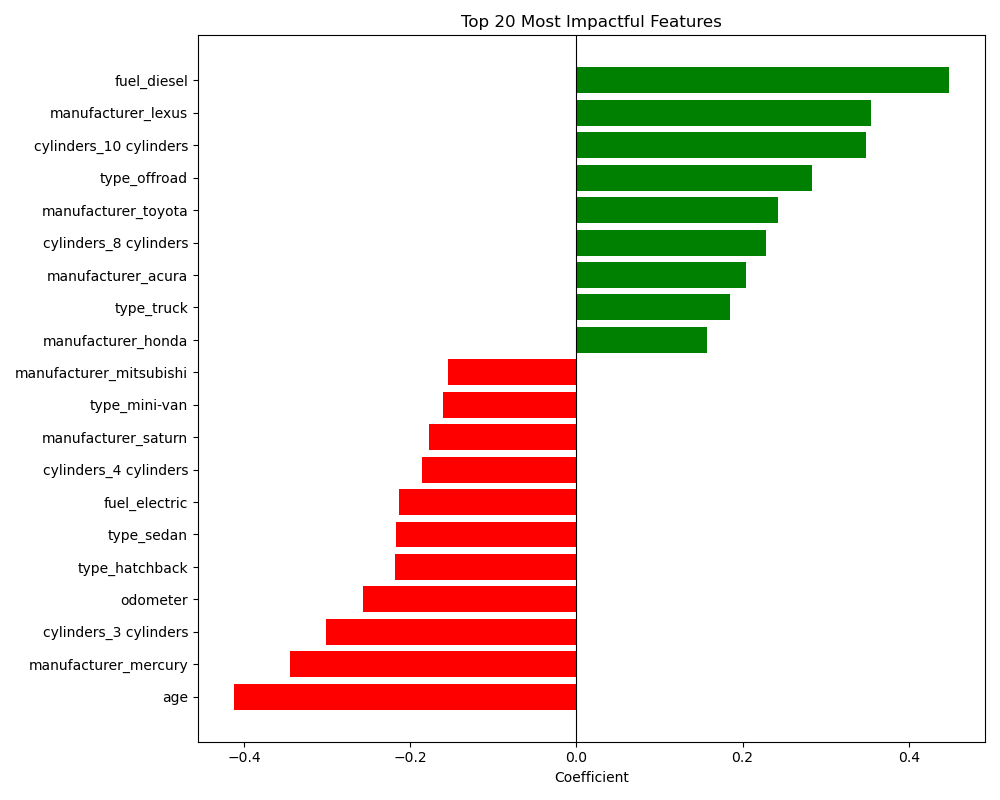

# What Drives the Price of a Car?

### Objective
Our client, a used car dealership, would like to know what consumers value in a car.  They plan to use this information to make decisions on what vehicles to keep in inventory that will fetch the highest sale price.

### Data & Model
The cleaned data set contained 58730 rows with populated data for vehicle age, manufacturer, condition, engine cylinder count, fuel type, odometer reading, drive type, vehicle type, paint color, and sale price. A Ridge Regression model was used with scaling and polynomial features of order 2 for numerical columns and one-hot encoding for categorical columns.  The resulting model had a RMSE of $3,883.42 and a MAE of $2,587.71.  The intercept was $11,980.37.  A breakdown of the coefficients is in the Results section below.

### Results

From the graph above, we can see that luxury auto makers like Lexus fetch a premium.  The data also suggest that diesels, trucks, offroad vehicles, and Toyotas also sell for more.  Hondas and Acuras are also both positive indicators suggesting that buyers will pay more for Japanese manufacturers.

Vehicle age is the biggest negative impactor on vehicle price with each additional year of age reducing the sale price by 7.2%.  Mini-vans, hatchbacks, and sedans sell for less with Mitsubishi, Saturn, and Mercury being the manufacturers that fetch the lowest sale price.  Mercury and Saturn are discontinued, which may explain why they are not sought after.  Smaller engine vehicles with 3 and 4 cylinders also tend to go for less.  Electric cars also go for less, suggesting that electric vehicles depreciate faster.

### Conclusion, Recommendation
The dealership should focus on selling luxury cars and offroad diesel trucks with larger engines.  They should avoid high mileage, older vehicles with smaller engines from budget or discontinued manufacturers.  Electric vehicles should also be avoided.

### Further Research
A focused investigation on specific luxury and offroad truck models that yield the highest sales prices could be performed by ensuring the model data is well-formatted and focusing the modeling to only those manufacturers and vehicle types.

### Reference
[Jupyter Notebook](prompt_II.ipynb)